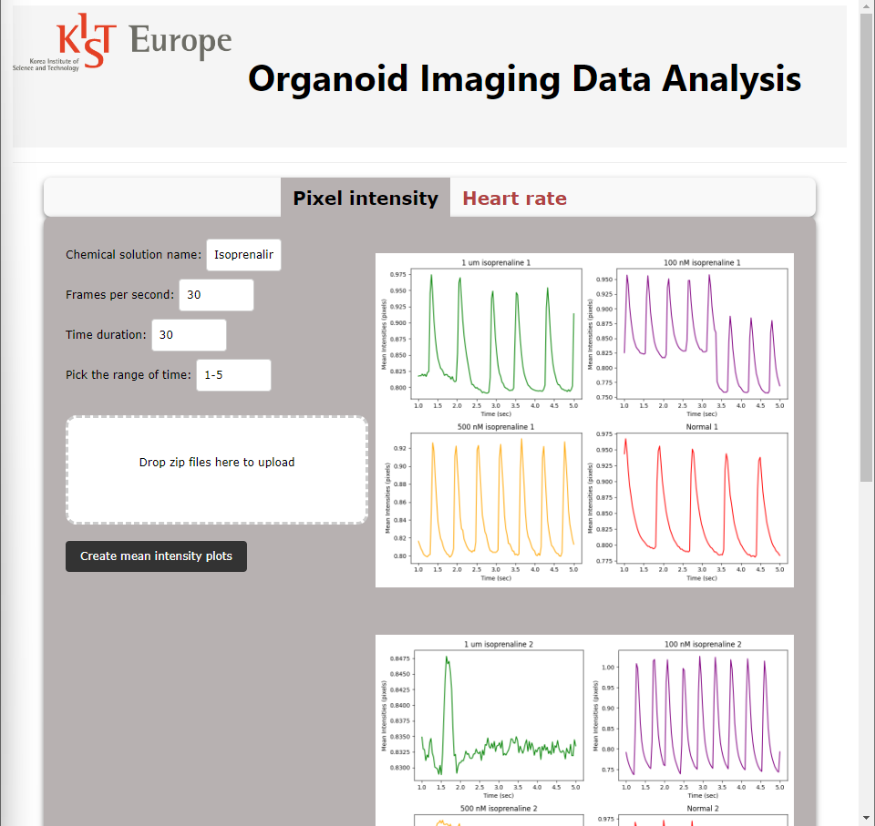
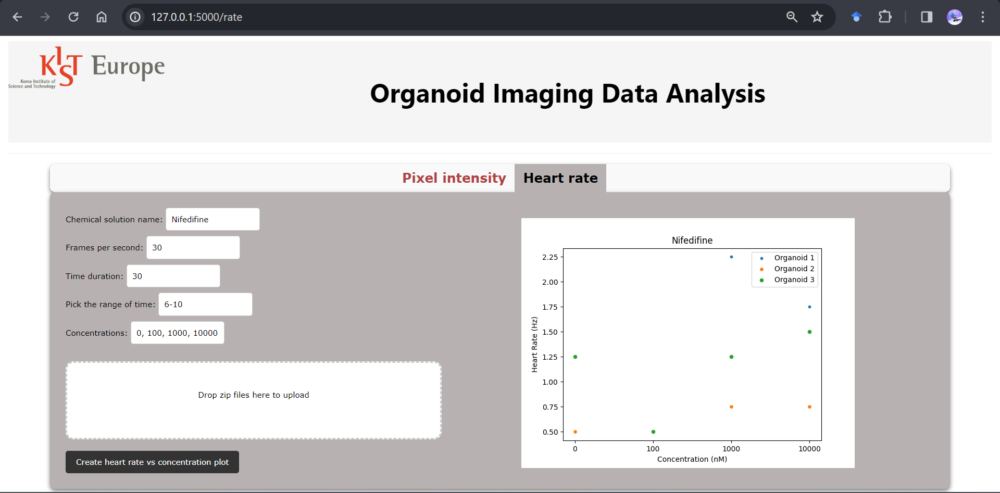

# Organoid Imaging Data Analysis

- 10 sec video of Cardiac organoid heart beating taken. The video has 30 frames per second. Then 300 images are then taken to do segmentation on it inorder to find the heart rate (mean pixel intensity per image/frame). 
with that imaging data, intensity plot and heart rate vs concentration plots are created.
- Flask web app is created to take inputs of each organoid experiment with different concentartion of chemicals like Isoprenaline, Nifedifine etc. This will help us compare the supposed behaviour of heart to Cardiac organoids.

OpenCV, Flask, NumPy, Scipy, Matplotlib.

